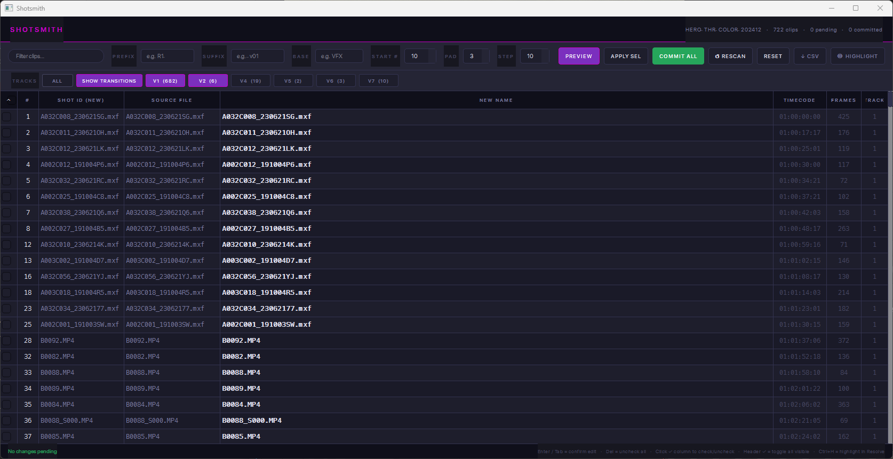

# Shotsmith

A spreadsheet-style timeline clip manager for **DaVinci Resolve**. See every clip on your timeline at once, filter by track, bulk-rename with patterns, edit names inline, and commit changes back to Resolve in one click.

Built for VFX and editorial workflows where you need to assign shot IDs, conform clip names, or audit a timeline — without scrubbing the timeline clip-by-clip.

---

## Features

- **Spreadsheet view** of every video clip on the active timeline
- **Bulk rename** with prefix / base / suffix / numbering pattern (e.g. `R1_VFX_010`, `R1_VFX_020` …)
- **Inline editing** — double-click any name and type
- **Track filters** — show only V1, V2, etc., or all
- **Hide transitions** by default (cross dissolves, fades, wipes…) — toggle on demand
- **Search/filter** clips by name or source filename
- **Apply selected** — commit only the rows you've checked
- **Highlight in timeline** — color-code checked clips inside Resolve
- **CSV export** of the current filtered view
- **Resolve clip colors** auto-set on rename so you can see what's been processed

---

## Install (easy)

1. Download the latest release zip from the [**Releases page**](../../releases) and extract it.
2. Run the installer:
   - **Windows:** double-click `install.bat`
   - **macOS / Linux:** open a terminal in the extracted folder and run `bash install.sh`
3. In Resolve: **Preferences → System → General → External scripting using = Local**, then restart Resolve.

PySide6 installs automatically the first time you run the script — no manual `pip` needed.

## Install (manual)

If you prefer to install by hand, copy `Shotsmith.py` to:

- **Windows:** `C:\ProgramData\Blackmagic Design\DaVinci Resolve\Fusion\Scripts\Utility\`
- **macOS:** `/Library/Application Support/Blackmagic Design/DaVinci Resolve/Fusion/Scripts/Utility/`
- **Linux:** `/opt/resolve/Fusion/Scripts/Utility/`

Then enable external scripting (step 3 above).

## Run

In Resolve with a timeline open:

**Workspace → Scripts → Utility → Shotsmith**

---

## Usage

### Bulk rename with a pattern
1. Fill in **PREFIX**, **BASE**, **SUFFIX**, **START #**, **PAD**, **STEP** in the toolbar.
2. Click **PREVIEW** to see the proposed names across all visible rows.
3. Click **COMMIT ALL** to write them to Resolve.

### Rename a subset
1. Tick the checkboxes on the rows you want to rename.
2. Either:
   - Type custom names in the **NEW NAME** column, *or*
   - Fill in the pattern fields above
3. Click **APPLY SEL** — checked rows are renamed and committed in one shot.

### Other
- **HIDE TRANSITIONS** — toggle to show/hide cross dissolves and fades.
- **↓ CSV** — export the current filtered view.
- **◎ HIGHLIGHT** — color the checked clips yellow in the Resolve timeline.
- **↺ RESCAN** — reload clips from the active timeline.
- **RESET** — revert all proposed names to original.

---

## Keyboard shortcuts

| Shortcut | Action |
|---|---|
| `Ctrl+R` | Rescan timeline |
| `Ctrl+P` | Preview pattern |
| `Ctrl+Return` | Commit all |
| `Ctrl+E` | Export CSV |
| `Ctrl+H` | Highlight checked clips in timeline |
| `Delete` | Uncheck all |

---

## Troubleshooting

The script logs to `%TEMP%/Shotsmith_log.txt` (Windows) or `/tmp/Shotsmith_log.txt` (mac/Linux). If something doesn't work, check that file first.

**Common issues:**
- "Could not connect to DaVinci Resolve" — ensure Resolve is running, has a project open, and *External scripting using* is set to **Local** in Preferences.
- Multiple `Resolve` processes — Resolve can occasionally leave a zombie process behind. Kill stale ones in Task Manager / Activity Monitor and the script will reconnect.
- Script hangs on launch — kill any stuck `fuscript` processes and try again.

---

## Requirements

- DaVinci Resolve (Free or Studio), v18 or later
- Python 3.9+
- PySide6

---

## License

MIT — see [LICENSE](LICENSE).
